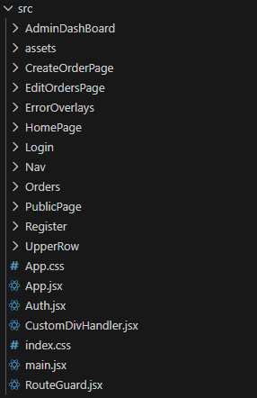

# Project Setup 
Firstly, you need to install **node.js 22 or higher** on your PC. This installs npm automatically with node.js so you don't need to install **npm** separately.

we use (you can check  `package.json`) :

 - npm-version : `11.6.2`
 - node-version : `v24.11.1`
 - react-version : `19.1.1`
 - vite-version : `7.1.0`
> you can use any higher than those version.
---

## To clone our repository:
- create a folder for project
- in that folder,run the following command
```shell 
git clone https://github.com/Isnotavailble/Order-Collection-Management-FrontEnd.git
```

## Downloading Dependencies
go to the folder `order-collector` which is our repo folder and run the following command in cmd : 

```shell
npm install
```
This will install every dependencies we need.
## Running the project:
in `order-collector` folder run the following command in cmd : 
```shell
npm run dev
```

----

## Project Structure
This is the overall structure.



####  Folder
- **AdminDashBoard**:
This Page was not done in time due to internal conflicts. There is nothing yet.
- **assests**:
This is the assests folder where we store png,fonts and customButton components.
- **assests/CustomButton**:
All the custom button components and their related css file. Any other files can be ignored.
- **CreateOrdersPage**:
create orders page and its components
- **EditOrdersPage**:
edit orders page and its components.
- **ErrorOverlays**:
the component that display error status in overlay ( z-index)
- **HomePage**:
home page component and its css file.
- **Login**:
login page 
- **Nav**:
side navigation bar component
- **Orders**:
collection of page component and its style models 
- **Orders/OrderDashBoard.jsx**:
 a page component
- **Orders/OrderCardModel.jsx**:
a card style component for order dash board page.
- **Orders/SearchBar.jsx**:
a search bar component for order dash board page. 
- **PublicPage**:
public page or landing page before login/registor process
- **Register**:
register form page
- **UpperRow/ProfileRow.jsx**:
for profile icon and user name on the head div ( including the logout right side bar)
- **App.jsx**:
main of React
- **Auth.jsx**:
a user data provider for auth process just to avoid props drilling
- **CustomDivHandler.jsx**:
just a handler component that will handle any child component when user at `"/" , "/login" , "/register"`
- **main.jsx**:
main component of React that wraps App.jsx(can be ignored)
- **RouteGuard.jsx**:
protects the child component when unauthorized user enters feature Pages (creatorderpage,...etc)

> ### Note:
> run with the cmd, not with live server extension or any other IDE interactions


